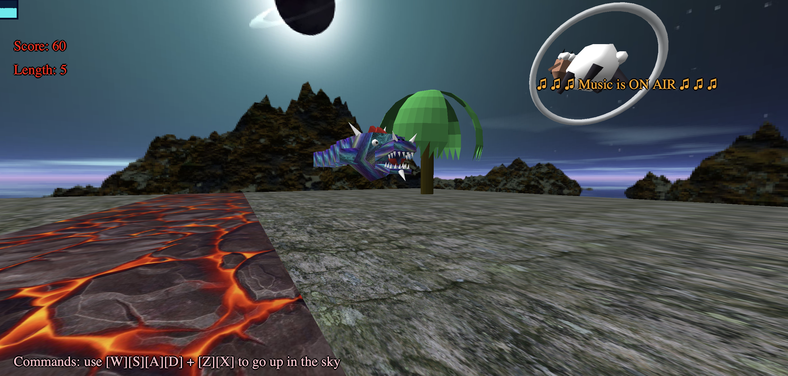

# Dragonsnake21

Final Project for Interactive Graphics course 2018-2019, Università La Sapienza Roma.

It is a reinterpretation of the classic Snake game, where here we have a dragon, in three different versions depending on the chosen world, which has to eat chicks or sheep to win: the higher the score, the more the speed / difficulty increases.

## Demo
Click here to free play (DEMO VERSION): https://sapienzainteractivegraphicscourse.github.io/finalproject-dragonsnake21

Three different songs available in the game!!!

## Team
* Flavio Lorenzi 

* Michele Ciciolla 

* Matteo Ginesi 

* Francesco Cassini 

## Documentation
You can read our technical documentation about this project here PDF [DOCUMENTATION](./documentation/report.pdf)

## Other
Introduction

The Red Planet

The Dark World

## License
This project is under MIT license - [LICENSE](./LICENSE)
